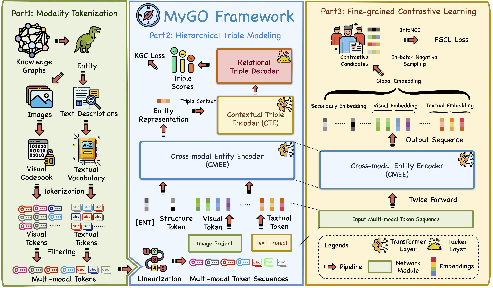

# MyGO: Discrete Modality Information as Fine-Grained Tokens for Multi-modal Knowledge Graph Completion

## Overview


## Dependencies
```bash
pip install -r requirement.txt
```

#### Details
- Python==3.9
- numpy==1.24.2
- scikit_learn==1.2.2
- torch==2.0.0
- tqdm==4.64.1
- transformers==4.28.0


## Data Preparation
You should first get the textual token embedding by running `save_token_embedding.py` with transformers library. The modality tokenization code will be released soon. You can first try MyGO on the pre-processed datasets DB15K and MKG-W. The modality tokenization needs to download the original raw multi-modal data therefore the code will need more time to be prepared.

## Train and Evaluation
You can refer to the training scripts in `run.sh` to reproduce our experiment results. Here is an example for DB15K dataset.

```bash
CUDA_VISIBLE_DEVICES=0 nohup python train_mygo_fgc.py --data DB15K --num_epoch 1500 --hidden_dim 1024 --lr 1e-3 --dim 256 --max_vis_token 8 --max_txt_token 4 --num_head 2 --emb_dropout 0.6 --vis_dropout 0.3 --txt_dropout 0.1 --num_layer_dec 1 --mu 0.01 > log_DB15Knostop.txt &
```

More training scripts can be found in `run.sh`.


```bigquery

@article{zhang2024native,
  title={NativE: Multi-modal Knowledge Graph Completion in the Wild},
  author={Zhang, Yichi and Chen, Zhuo and Guo, Lingbing and Xu, Yajing and Hu, Binbin and Liu, Ziqi and Zhang, Wen and Chen, Huajun},
  journal={Authorea Preprints},
  year={2024},
  publisher={Authorea}
}
```